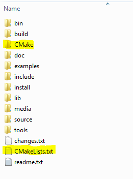
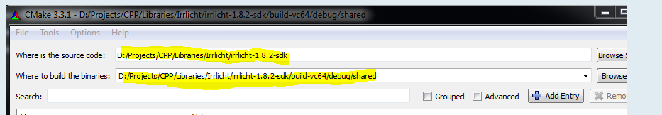
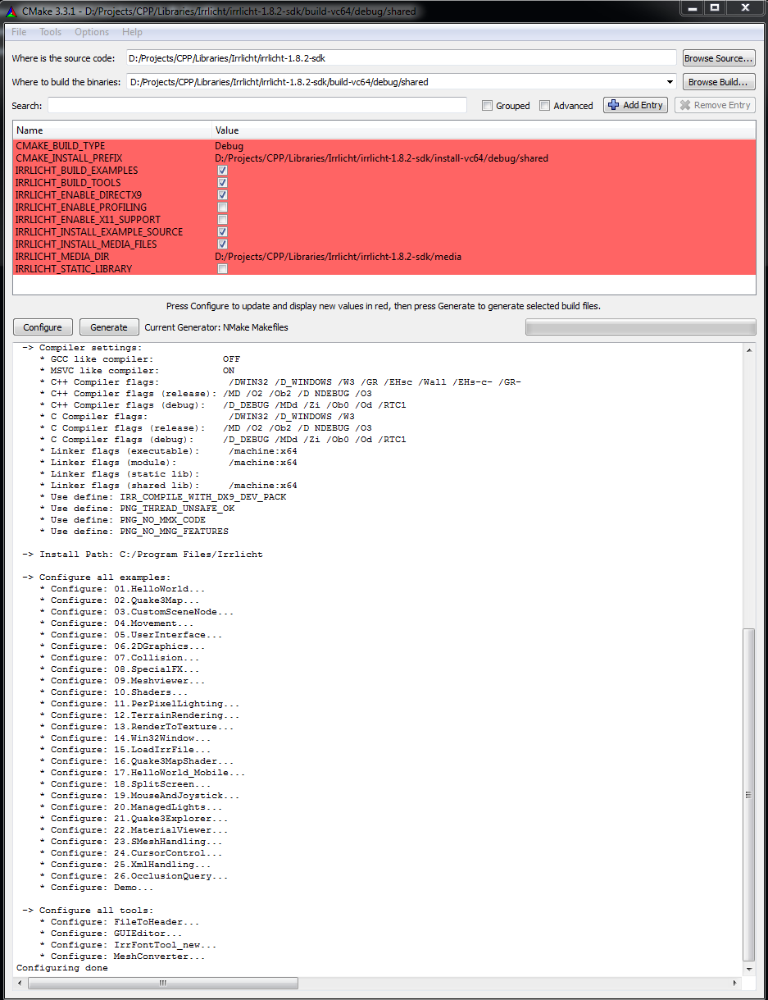

# An Irrlicht CMake build system

## Index

* [Introduction](#Introduction)
* [Latest Version](#LatestVersion)
* [Usage](#Usage)
 * [Preparation](#Preparation)
 * [Compiling the whole library](#CompilingTheLibrary) 
 * [Compiling examples and tools](#CompilingExamplesAndTools) 
* [Version History](#Version History)

##  Introduction

### What is CMake
CMake is a meta-build system, that generates all kind of different make-files or project-files. You just need to specify the make-system you want to use (gnu make, nmake, ninja mingw-makefiles, msys-makefiles) or an IDE you use (Eclipse project file, Visual Studio project file) and CMake will then generate all necessary files for that.
The big advantage - compared to single Makefiles and project files - is that you just need to maintain the files of CMake and you don't need to maintain all VC-project files and makefiles independently.
Of course you first need to understand how CMake works, but I was able to learn it very fast and I hope I wrote the CMake files in a way that they are easy to maintain.
From my point of view CMake is the only way to have a build-system that is compatible to any compiler and any operating system. I'm always happy when I download an open source project and see that is uses CMake for compiling.

### What can this CMake-System do
With my CMake files you can compile the Library itself (as static or shared, debug or release version) and if you want, you can also compile all examples and tools with the same settings. You can start the compilation of "everything" just by entering one command to your shell.
I implemented the CMake-System for Windows, Unix Like systems and MacOSX. It should also support GCC (including MingW 32/64bit), Visual C++, Intel-Compiler (windows/linux) and CLang.

##  Latest Version

### Upcomming: master-branch (unstable not tested yet)

#### Highlights
 * nothing planned

#### Fixes
 * nothing planned

### 28.09.2015: Version 0.2.2 ([Download as ZIP](https://github.com/ZahlGraf/IrrlichtCMake/archive/v0.2.2.zip))

#### Highlights
 * For Irrlicht 1.8.3
 * Change license to ZLIB to be fully compatible with the Irrlicht license
 * Use CMake FindLib command to find paths to X11, Xft, fontconfig and freetype library
 * Print CMake warning when examples/tools are build without installed Xft, fontconfig and freetype library

#### Fixes
 * Error since wrong include file-name at sensitive file system (pull-request [#1](https://github.com/ooxi/IrrlichtCMake/commit/767b2fffb82ab5b6b5fefa44f1efbcf734f79a97))
 
#### Tested Compilers
 * MSVC2015 (Windows7), 64bit
   * debug: static/shared
   * release: static/shared
   
 * Intel Compiler 16.0 together with MSVC2015 (Windows7), 64bit
   * debug: static/shared
   * release: static/shared
   
 * MSVC2015 (Windows7), 32bit
   * debug: static/shared
   * release: static/shared

   
 * MinGW (GCC 4.9.3) (Windows7), 64bit
   * debug: static/shared
   * release: static/shared

   
 * MinGW (GCC 4.9.3) (Windows7), 32bit
   * debug: static/shared
   * release: static/shared

   
 * GCC 4.9.2 (Debian), 64bit
   * debug: static/shared
   * release: static/shared

   
#### Attention:
 * MacOSX and CLang has not been tested so far. It would be really great if you could test it and send me a feedback or - in case of errors - a patch.

##  Usage
###  Preparation

 * Install [CMake](http://cmake.org/) at your system. I used CMake 3.3.1 for the creation of the files. However I think also older CMake versions should work.
 
 * Take care that CMake and also the Compiler binaries are in your PATH variable when configuring the build (For example on windows you may have to execute a batch file of the compiler to have the compiler binary on your PATH. The batch file for MSVC2015 is called `VsDevCmd.bat` and can be opened from the Start Menu).
 
 * Download a ZIP of this build system and copy all files into your Irrlicht directory. Take care that the `CMakeLists.txt` is in the root path of irrlicht like here:
 
 
 
 (The CMake build system should not overwrite any file of the Irrlicht directory. It just adds some new files and directories!)

###  Compiling the whole library

**Attention:** For my description I used the Visual C++ 2015 64bit compiler. However the description can be used for every compiler, just add other compiler names into it :-)

 * Open the command line promt with CMake and the Compiler at your PATH variable
 
 * Goto the Irrlicht root directory. I will always say `<irrlicht-root>` to it in this descriptions.
 
 * Enter `cmake-gui` to your command-prompt to open CMake (I will only explain the CMake GUI process, because I guess the Experts that use CMake from command line, know how to compile anything with CMake :-) ). 
 
 * On the top of the window, you will see two text fields "Where is the source" and "Where to build the binary":
   * Enter in "Where is the source" the Irrlicht root directory `<irrlicht-root>` where also the `CMakeLists.txt` file is inside.
   
   * Enter in "Where to build the binary" a path where all temporary files for the build process are stored. I would suggest `<irrlicht-root>/build-vc64/debug/shared` when you build with Visual C++ 64bit the debug shared library. 
     By using such a directory naming you can easily build and use Irrlicht with different compilers and for different library types (debug/release, shared/static).

   
   
 *  Click on Configure. It asks you, if it should create the build path - click on "Yes" and then you can select the build-system you want to use. 
   * **For Visual C++:** you can use "NMake Makefiles" or you can create a Visual Studio Project file.
   * **For MinGW:** you can select MingW Makefile or MSYS-Makefile (I prefere MSYS-Makefile). 
   * **For GCC on Linux:** just select Unix Makefile.
   
   
 * Below at the build system selector you can select if you want to use **default compiler** or if you want to use a different compiler. 
   For example for Intel Compiler on Windows, you select NMake Makefile and "Specify native compilers" where you can now specify the "ICL" command instead of the Visual C++ "CL" command for compiling.
	 
 * After clicking on Finish, the system searches for the compiler binary and figures out where it can find OpenGL and DirectX. 
   When you build the main project (Irrlicht Library) there should not be any Warning or Error. 
   
 * In the text window on the bottom, you should get a summary of your configuration and you should read the text "Configuration done". 
 
 * In the middle part of the window, you will see a red list of variables, that have been changed in this configuration step.
 
 * With CMake it is important to use the configure option as often as there are no red variables left. This means "nothing have been changed in the last step".
	 
 * Edit the variables you want to change. Make sure, that you set at least the following one:

   * `CMAKE_BUILD_TYPE` = [Debug|Release] Specifies if you want a debug or release build.
   
   * `CMAKE_INSTALL_PREFIX` = The Path where you want to install all files of the Irrlicht Library after compiling. For example: `<irrlicht-root>/install-vc64/debug/shared`
	 
 * There are also some options you can enable or disable:
   
   * `IRRLICHT_BUILD_EXAMPLES` = [On|Off] Enable this to build also the examples.
   
   * `IRRLICHT_BUILD_TOOLS` = [On|Off] Enable this to build also the tools.
	
   * `IRRLICHT_ENABLE_DIRECTX9` = [On|Off] Enable this build with DirectX9 support (Windows only).
	
   * `IRRLICHT_ENABLE_PROFILING` = [On|Off] Enable this to build with profiling support.
	
   * `IRRLICHT_ENABLE_X11_SUPPORT` = [On|Off] Disable it, if you want to skip the X11 support (MacOSX only).
	
   * `IRRLICHT_INSTALL_EXAMPLE_SOURCES` = [On|Off] Disable it, if don't want to copy the example sources into the example binary directory.
	
   * `IRRLICHT_INSTALL_MEDIA_FILES` = [On|Off] Disable it, if don't want to copy the media files to the install directory. They are necessary to run the examples out of the box.
   
   * `IRRLICHT_STATIC_LIBRARY` = [On|Off] Enable it if you want to build Irrlicht as a static library.
	

	
 * After setting up all variables, click again on "Configuration", until no red variables left.
 
 * Then click on "Generate" for generating the makefiles or project files.
 
 * In the command line window, change to the build directory (for example `<irrlicht-root>/build-vc64/debug/shared`
 
 * Start the library compile build with:
   * **Visual C++:** `nmake`
   * **MinGW/GCC:** `make`
   
   
 * After successfull compiling the lib, install all files with:
   * **Visual C++:** `nmake install`
   * **MinGW/GCC:** `make install`
	
	
 * Have a lot of fun :-)
	
###  Compiling examples and tools 

This build system compiles all examples and tools together with the Irrlicht library for you. However sometimes it could be helpful to just compile a single example or tool. This is also supported, since CMake can build from any directory where a `CMakeLists.txt` file is inside. 

 * Compiling a single example is very easy: Follow the steps from above, however as source path please use the directory where the example is inside.
 
 * Furthermore, since the library is not compiled together with the example, you have to specify some additional setting where CMake can find the Irrlicht library. During the configuration step you will get errors as long as the build system does not find all dependency files.
 
 * These are the additional setting:
 
   * `IRRLICHT_INCLUDE_DIR` = Where to find the `irrlicht.h` header file.
   * `IRRLICHT_LIBRARY` = The path to the Irrlicht link library (found in the install directory inside `lib`). 
   * `IRRLICHT_SHARED_BIN` = The path to the Irrlicht shared library (found in the install directory inside `bin`) **Note:** This is only necessary when you use an non-static version of Irrlicht.
   
##  Version History

### 25.09.2015: Version 0.2.1 ([Download as ZIP](https://github.com/ZahlGraf/IrrlichtCMake/archive/v0.2.1.zip))

#### Highlights
 * For Irrlicht 1.8.3
 * Initial GitHub release
 
#### Tested Compilers
 * MSVC2015 (Windows7), 64bit
   * debug: static/shared
   * release: static/shared
   
 * Intel Compiler 16.0 together with MSVC2015 (Windows7), 64bit
   * debug: static/shared
   * release: static/shared
   
 * MSVC2015 (Windows7), 32bit
   * debug: static/shared
   * release: static/shared

   
 * MinGW (GCC 4.9.3) (Windows7), 64bit
   * debug: static/shared
   * release: static/shared

   
 * MinGW (GCC 4.9.3) (Windows7), 32bit
   * debug: static/shared
   * release: static/shared

   
 * GCC 4.9.2 (Debian), 64bit
   * debug: static/shared
   * release: static/shared

### 13.09.2015: Version 0.1.0 ([Download as ZIP](http://www.file-upload.net/download-10907937/irrlicht-1.8.2.zip.html))

#### Highlights
 * For Irrlicht 1.8.2
 * Initial CMake build system for Irrlicht (no release on GitHub)
 
#### Tested Compilers
 * MSVC2015 (Windows7), 64bit
   * debug: static/shared
   * release: static/shared

 * Intel Compiler 16.0 together with MSVC2015 (Windows7), 64bit
   * debug: static/shared
   * release: static/shared

   
 * MinGW (GCC 4.9.3) (Windows7), 64bit
   * debug: static/shared
   * release: static/shared

   
 * MinGW (GCC 4.9.3) (Windows7), 32bit
   * debug: static/shared
   * release: static/shared

#### Attention:
 * MacOSX and CLang has not been tested so far. It would be really great if you could test it and send me a feedback or - in case of errors - a patch.
